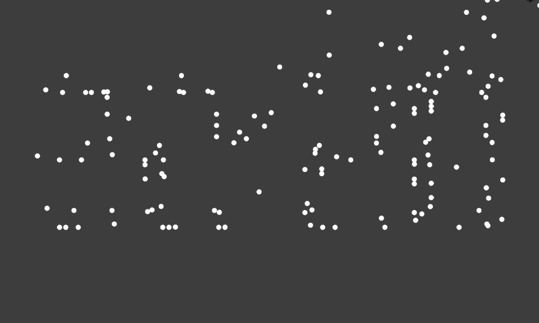
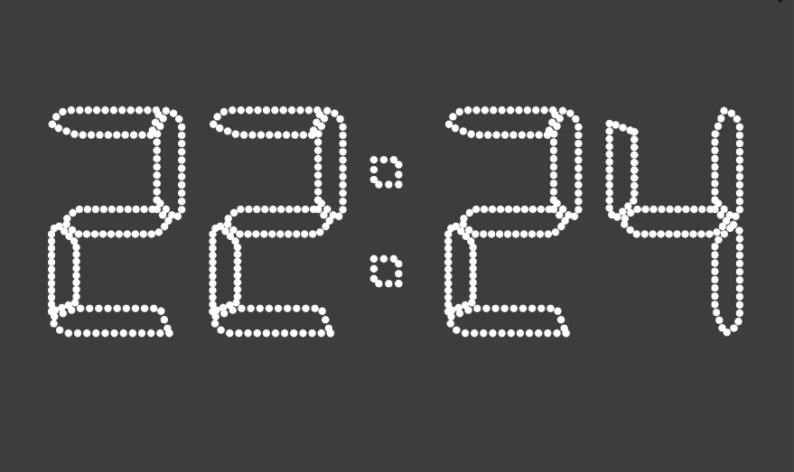

# Agent clock

A visualization of a clock using simple agents and physics.

## Description

The digits of the clock are basically letters or svg paths. These paths are broken down into pieces. The pieces are postions which will get occupied with "agents". These agents spawn at and have the goal to reach a random spot on these paths thus slowly reavealing the time. The spawn location is a position outside the screen where the second hand would be - it wanders clockwise around the scene. If the minute is over the dots are cleared and the process restarts.

### Begining of the minute

Only a few dots are there


### 30 seconds of the minute

More and more dots floating in
)

### All dots there



Flutter should have been [installed](https://flutter.dev/docs/get-started/install)

``` bash
git clone https://github.com/kruegerrobotics/flutter_agent_clock.git
cd flutter_agent_clock
cd agent_clock
flutter create .
flutter run
```

## Inspirations

### The coding train

This project was inspired by The Coding Train Challenge [#59: Steering behaviors](https://www.youtube.com/watch?v=4hA7G3gup-4&feature=youtu.be) Thanks to Daniel Shiffman!

### Flutter canvas tutorial

This is a [canvas tutorial](https://medium.com/flutteropen/canvas-tutorial-01-how-to-use-the-canvas-in-the-flutter-8aade29ddc9) and has a way to become independed of the screen size with the *"size tool"*. This has been reused here.

## 3rd Party library use

This project uses the public availabe flutter library [Text to Path Maker](https://pub.dev/packages/text_to_path_maker). For breaking the TTF into segments,

## Ideas for further improvement

### Multiple fonts and "text to point"

Refine the text to path maker or develop an algorithm that breaks the TTF font path and can put dots on the path in equal distance. This would allow the use of any font. At this point in time the point allocation is on certain fonts not equidistant and not visually appealing. The overall coding of the postioning should be less static

The algorithm could be improved inspired by [textToPoints](https://p5js.org/reference/#/p5.Font/textToPoints) from the p5js project.

### Other ideas

- Improve the streaming in of the agents depending on weather
